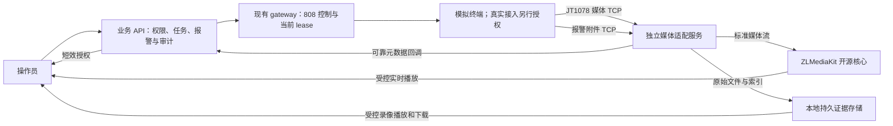

# C1 实时监控与报警录像取证最小设计（2026-09-12 审阅稿）

状态：设计提案，未批准实施。基准提交 `da6eaeb7b82b1cb0d03f75c36b0e6423e9e7f028`。本轮没有下载或启动媒体产品，没有修改业务代码、迁移、manifest、云配置，没有连接真实设备或云端业务数据库。

## 业务范围与推荐

首期必须同时交付实时监控和报警录像取证，用户已确认没有可复用媒体服务。推荐 **ZLMediaKit 开源核心负责分发／播放，本项目新增独立 JT1078 接收适配和报警附件接收服务**。现有 API/gateway 继续负责设备、权限、报警归属和 session lease。初期单节点、固定协议及编码子集，不引入隐含的商业插件依赖。

取证推荐以**终端本地预录的报警视频上传**为主路径：无需操作员提前打开直播，可以取得报警前片段；断网期间终端本地仍有录像时可恢复后补传。必须先确认目标终端的协议与本地预录支持，不能把“报警后开始录直播”当作完整的前后取证。

若终端不支持，M0 必须提请明确变更为持续上行、平台环形缓存截段，并评估断线空窗、流量成本及覆盖范围，不能静默降级。当前下一步是审阅方案，尚未批准原始报警标识保留、后续 DDL、媒体代码或真实接入。

## 当前资产与缺口

| 资产 | 可复用部分 | 尚缺部分 |
| --- | --- | --- |
| 声明 V22/V6、0x9003/0x1003 | DECLARED、设备关联、幂等、审计与冲突门禁 | 媒体实证，不自动 VERIFIED |
| gateway 鉴权与 session lease | 控制信令归属、当前代次检查 | 0x9101/0x9102、可靠命令及媒体任务生命周期 |
| Jt1078ControlModule / AlarmAttachmentMessageCodec | 0x9208、0x1210/1211/1212/9212 及部分文件控制 codec | 独立媒体／文件字节接收，不向 808 链路或业务 API 发送视频内容 |
| AlarmAttachmentService、attachment/transfer 表、回调和 RBAC | 状态机、摘要比对、访问审计、read-back | requestUpload 当前固定拒绝 ALARM_IDENTIFIER_UNAVAILABLE；缺少实际编排及媒体适配 |
| AlarmAttachmentMediaPort | 上传目标、短效 URL、HMAC-SHA256 回调合同 | 当前仅有 UnavailableAlarmAttachmentMediaAdapter |

前置缺口：当前仅保留原始 16 字节报警标识的摘要，无法反推 0x9208 所需原值。必须单独审阅变更此前保留裁决。建议受控保留原始标识、协议版本、terminalId、报警关联及到期时间，摘要继续用于审计；不公开到操作员 API 或普通日志。存储访问受限，原值需加密保存且密钥与数据分离，可靠队列 payload 同步审查保留策略。历史摘要无法逆转，不回填伪造值。该政策及存储扩展未获准前，不能开启这条终端取证路径。

## 官方资料选型评估

查阅日期 2026-09-12，仅文档评估，没有产品集成实测。

| 方案 | 已核实事实 | 本项目判断 |
| --- | --- | --- |
| **ZLMediaKit 开源核心（推荐）** | 自有代码 MIT；有流管理、MP4 录制 API、播放／录制回调。原生 JT1078、专业转码、S3 直写列在闭源专业版。 | 分发／播放可复用；JT1078 适配、附件接收、证据归档自建。不把商业功能当免费开源能力，兼容性必须实测。 |
| **SRS** | MIT；官方支持 RTMP、WebRTC、HLS、HTTP-FLV 等，有 DVR／转码文档。查阅的官方清单未确认原生 JT1078。 | 可作适配后的分发后端，仍需协议接收与取证服务。适合已有 SRS 运维资产的团队，当前没有该优势。 |
| **EasyCVR** | 官方发布记录写明 1078/808 接入及录像接口；手册要求机器码激活等授权，未据此获得完整产品的开源许可。 | 按需授权产品评估。须确认能否只承接媒体、保留现有 gateway 的 808 控制，以及 T/JSATL12 关联、回调、原件导出。若必须接管设备登录，会影响现有 lease 架构。 |

资料：[ZLMediaKit 版本范围](https://github.com/ZLMediaKit/ZLMediaKit#闭源专业版)、[许可](https://docs.zlmediakit.com/more/license.html)、[录制 API](https://docs.zlmediakit.com/guide/media_server/restful_api.html)、[回调](https://docs.zlmediakit.com/guide/media_server/web_hook_api.html)、[SRS 官方仓库](https://github.com/ossrs/srs)、[EasyCVR 发布记录](https://old.tsingsee.com/download/EasyCVR.html)、[EasyCVR 授权手册](https://www.tsingsee.com/download/easycvr/EasyCVR-Manual.pdf)。EasyCVR 手册本轮通过官方文档的索引摘录核对授权，完整 PDF 打开失败，未核对私有管理接口合同。

这里的推荐是工程判断：开源核心配合自建适配能保持现有身份、控制和审计边界，但须承担协议工作。商业备选为 ZL 专业版或 EasyCVR，先取得可隔离运行的评估授权和接口说明，经 M0 再估算节省量；不能仅凭“支持 JT1078”承诺替代所有报警及设备工作。构建前固定所选版本、commit、digest，并核对实际依赖许可。本轮不采购、申请授权或连接厂商演示设备。

## 最小架构

媒体服务提供直播和附件两种接收器：前者重组 JT1078 分片、序号和时间戳并转封装；后者处理附件会话、文件分块、重传和完成确认。ZL 负责已适配媒体的分发；其录制 hook 不直接等于本项目可靠取证回调。

首期存储为单机持久目录，服务生成不透明对象 ID，提供原子归档及专用证据索引，二进制不进业务数据库。存储接口保留未来对象存储替换点；配额、备份与恢复必须验收。单节点不具备多副本容灾，普通目录和 SHA-256 也不等于 WORM 或司法认证；如需不可删除保全／异地冗余，需增加专项。

业务 API 只返回任务／证据元数据和短效授权，不返回媒体管理密钥、永久 URL 或原始上传目标。隔离验证使用本地网络和模拟身份。

## 实时监控链路

1. 按车辆选择关联终端及逻辑通道，校验权限、当前关联、声明冲突、配置版本，建立带请求幂等键的任务。
2. 先分配媒体接收会话，再由当前 lease 所属 gateway 发送 0x9101；记录命令 ID、terminalId、channel、connectionId、leaseGeneration、超时和审计。通用应答仅证明控制应答，收到可解码帧后才成为 PLAYING。
3. 接收器校验服务端任务、设备／通道、监听端口、时间窗口及连接归属；处理拆包／粘包、分片重组、序号回绕、丢片、时间戳与限流。首期 H.264 视频和 TCP，转为受限内网 RTMP 输入 ZL。此适配需新增，不假设开源核心直接接收 JT1078。
4. 浏览器用受控 HTTPS/WebRTC 观看；实际验证编码 profile、关键帧、浏览器解码，不能从“支持 H.264”推导所有终端均兼容。
5. 停止、超时、权限失效或 lease 切换时，立即关闭平台播放／入流授权；对匹配的当前控制会话发送 0x9102，失败追踪。停止直播不释放设备全局 lease。多观看者共享流引用计数，但分别授权和审计。

状态提案：REQUESTED → WAITING_STREAM → PLAYING → STOPPING → CLOSED，失败保留具体原因。重试不得复用旧代次媒体身份。

核验引导：DECLARED 设备要先实测才能 VERIFIED，不能因正式运营门禁形成死循环。提案设置独立且受权限／审计保护的媒体核验会话，不改正式配置的 VERIFIED 要求、不自动赋予运营 VIDEO 角色；真实核验模式仍需另行授权。实测后使用已有核验接口记录人员、版本及证据，再做正式 preview/apply/read-back。

身份限制：标准 JT1078 媒体包不携带本系统 leaseGeneration 或强认证令牌，不能虚构字段。归属依赖服务端任务、专属监听资源、控制会话与连接窗口；SIM／通道／源 IP 本身不是密码学身份。公网需另审受控 APN/VPN 或等效网络准入，模拟成功不能证明公网防伪已解决。

## 报警录像取证链路

1. ADAS/DMS 报警经既有入口落库，使用报警发生时的车辆归属和 terminalId；后续转绑不能将旧视频改挂新车辆。
2. 持久任务按 alarmId、terminalId、channel、时间范围、策略版本幂等认领；分配有时效的上传资源，再通过当前控制会话发送 0x9208。必须有原始标识，历史只有摘要时明确返回不可补取。
3. 终端向独立附件端发送 0x1210/1211/1212 等控制及文件。复用现有 codec，但补齐文件分块、缺块重传、完成校验与回执，按正式协议验证；0x1212 或元数据不是文件收齐证据。
4. 绑定设备／报警／文件及任务，限制大小和时长；收齐后核验实际字节数、SHA-256、可解码性、通道与时间覆盖。终端提供摘要时比对，否则如实记录服务端摘要，不宣称做了双方比对。
5. 原件原子归档，分配稳定 evidenceId；播放副本独立存储并关联原件摘要及变换版本。报警详情支持播放、原件下载和校验信息。文件持久化后才回调；AVAILABLE 需业务状态／审计提交且文件可读。
6. 断线退避重试，旧连接不能续写新任务；补传受终端本地保留周期限制。过期、缺片、时间覆盖不足明确失败或不完整，不以图片／告警元数据／部分录像代替完整成功。

本最小范围不同时新建任意历史录像检索回放协议。若 M0 确认目标只能通过 0x9205/0x1205/0x9206 等方式提供视频，则重新审阅协议子集和估算；现有部分控制 codec 不代表该路径完成。

## 可靠性、审计和配置冲突

- API 状态与审计同事务；媒体调用在事务外由持久待办驱动，不在数据库事务中等大文件。先审查已有 transfer 并发约束，再决定新增任务、投递／证据索引结构；所有 DDL 独立审阅。
- 文件流程为临时文件 → 完整性／解码检查 → 原子归档 → 持久回调队列 → API 确认。回调失败重试／对账，审计失败不返回业务成功。归档孤儿文件隔离待核对，重启后恢复，不立即删除。
- 延用 raw body 的 HMAC-SHA256、timestamp、nonce 合同，增加持久业务事件 ID 和内容摘要。同事件同内容不重复成功审计，异内容冲突拒绝。现有 nonce 内存缓存不能承担重启后的幂等；重试用新签名／nonce、同业务事件 ID。
- ZL 录制通知不能替代端到端可靠投递；适配器须落盘认领，目录／索引对账补偿。官方说明 MP4 完成通知对回复不敏感。[hook 合同](https://docs.zlmediakit.com/guide/media_server/web_hook_api.html)
- 请求、停止、失败、完成、关联、查看／下载授权、实际访问、过期／删除、人工核验记录 actor/task/terminal/alarm、时间、版本和原因，不记录短效令牌。命令应答、媒体成功、业务成功分别记录。
- 开始时核对声明、能力、配置版本；声明冲突未解除、通道或编码不符时阻断运营任务并说明原因。lease／关联变化使直播授权失效；历史证据保留事件归属。声明不覆盖 VERIFIED，实测核验要有真实证据。
- 媒体失败不阻塞定位和报警事实，附件可见待重试／失败。不可解码、存储失败、摘要冲突、越权、取证不完整均不得推动 A 放行。

## 验收参数提案

以下数值仅为估算／审阅基线，尚未批准或生效；M0 前固定验收口径。

| 项目 | 提案 |
| --- | --- |
| 编码／传输 | H.264 视频，TCP 上行，WebRTC 观看；音频、对讲、通用 H.265 转码不在默认范围 |
| 小规模容量 | 最多 4 路同时上行、4 路观看，每路 2 Mbps；尚未做性能实测 |
| 实时体验 | 隔离 LAN 首帧 ≤5 秒，播放延迟目标 ≤2 秒，连续 30 分钟；公网按设备和网络另验 |
| 报警片段 | 每目标通道前 15 秒、后 30 秒；允许为关键帧多保留，不允许少保留；终端预录是前提 |
| 时间一致性 | 保留终端及接收时间；偏差超过 2 秒标记核查，未确定时间映射不得标记完整覆盖 |
| 访问／保留 | 访问授权建议 60 秒且可撤销；证据 30 天；人工保留中的证据不自动清理 |

容量推导：4×2 Mbps=8 Mbps 入流，4 路同码率观看另需约 8 Mbps 出流，不含开销。45 秒、2 Mbps 片段约 11.25 MB/通道；100 次报警/天、2 通道/次、30 天约 67.5 GB 原件，另加副本、临时空间、索引及备份。持续上行一路 2 Mbps 每天约 21.6 GB，4 路约 86.4 GB/天，不能沿用事件上传成本。

## 分阶段工作量

熟悉项目工程师的人日，含实现、定向测试及文档，不是日历承诺。已完成声明和当前 gateway 构建不重复计入。明确开源接收适配、完整附件上传及证据可靠性后，**媒体预算从此前 18–30 更新为 25–40 人日**，置信度中低。

| 阶段 | 交付／出口 | 人日 |
| --- | --- | --- |
| M0 兼容与合同 | 固定版本／依赖许可、协议样本、终端资料、预录／时间口径、原始标识政策及 DDL 提案；本地合成探针验证媒体输入和浏览器输出。支持缺失先重审。 | 2–3 |
| M1 共用基础 | 独立接收、JT1078 重组、命令任务和 lease 归属、持久队列、存储／回调、鉴权和故障隔离。 | 8–12 |
| M2 实时监控 | 0x9101/9102、可解码首帧、WebRTC 页面、停止／过期／重连和审计，合成实时闭环。 | 4–6 |
| M3 报警取证 | 获准后保留原始标识、附件任务及上传／补传、原件与副本、摘要／时间覆盖、检索下载、保留及审计，合成取证闭环。 | 7–12 |
| M4 隔离组合 | 最终 API/gateway/媒体候选与隔离 PG；跨设备拒绝、重启、磁盘满、DB／审计失败、回调重放、并发上限、备份恢复、双路径及配置 read-back。含 gateway 必要重建和组合验证。 | 4–7 |
| 合计 | 共用基础计一次；阶段均以评审及证据为出口 | **25–40** |

Hibernate 另预留 2–4 人日，可并行；真实核验再预留 2–4 人日操作与记录，不含设备／厂商等待。采购、云部署、公网网络建设、HA、无限期离线补传、多厂商变体及额外编码兼容不在上表。目标若仅支持 H.265，M0 重估，不默认为已支持。

M1/M3 可能需要任务、回调收据、证据和原始报警标识的存储扩展，先复用 attachment/transfer，再出字段、唯一约束及恢复提案。**本稿不预占迁移编号，不修改 V22/V6，不新增 SQL，不改队列白名单。** 获准实施时再检查实际迁移序列，独立审阅。

## A 条件及下次入口

现在不具备 A 启动条件。声明最小链路和当前 gateway 本地构建已完成，只有 DECLARED；实时及取证媒体未实施，没有真实设备 VERIFIED 证据。镜像只验证了无网络启动及单独 Java TCP/HTTP 合同，尚未完成最终候选容器组合媒体验收。

继续顺序：审阅本设计及参数 → 单独批准原始报警标识保留／新增持久化 → M0–M4 隔离实施和验证 → 另行授权真实设备双路径核验 → 既有核验接口记录 VIDEO VERIFIED 及证据 → 配置 preview/apply/read-back 和原有其他 A 门禁。媒体改变 gateway 字节后需重建并记录最终 digest，当前镜像不能替代未来字节验证。

本次审阅决定：ZL 开源核心加独立适配；终端本地预录上传主路径；原始报警标识受控保留方向；编码／容量／片段／保留基线。设计审阅不扩大真实设备、云端或部署权限。
