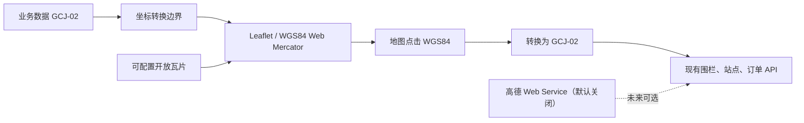

# 开放瓦片地图替换设计

**日期：** 2026-07-18  
**状态：** 待审阅  
**范围：** 通渭县区域动态响应公交试点管理端

## 目标与边界

试点管理端采用 Leaflet 与无需 Key 的开放瓦片底图，消除前端对高德 JS Key、JS 安全密钥、白名单和配额的依赖。覆盖调度工作台、服务区电子围栏、虚拟站点选点和订单坐标选点。

本次不实现离线地图、瓦片预下载、批量缓存、公开地理编码、公开地址联想或新路径服务。高德 Web Service 适配器保留在后端，默认关闭，作为后续取得正式授权后的可选增强。

## 方案选择

默认瓦片地址为 `https://tile.openstreetmap.org/{z}/{x}/{y}.png`，由环境变量覆盖。界面始终展示 `© OpenStreetMap contributors` 归属。只加载用户当前可视区域的瓦片，不做预取、离线包、服务端代理或主动缓存。

OSM 标准瓦片没有 SLA，可能限流或中断，因此仅作为低并发试点底图。正式规模化运行需切换到自建或具有明确许可和服务保障的瓦片服务，但不改变地图业务接口。

## 架构

新增前端地图基础层：

- `tileMapRuntime`：创建、销毁和重绘 Leaflet 地图；读取瓦片 URL、归属和缩放配置。
- `coordinateTransform`：GCJ-02 与 WGS84 双向转换。所有业务接口仍收发 GCJ-02。
- `tileMapTypes`：收敛 Leaflet 和绘制插件使用的最小类型，避免组件依赖高德全局对象。

移除前端高德 Loader、类型、`VITE_AMAP_*` 开关和组件 `amapEnabled` 属性。后端 `drt.map.amap` 配置与 API 不删除，但默认保持关闭。

## 交互与数据流

### 调度工作台

服务区、多站点、车辆位置、任务站点连线和人工位置链从 GCJ-02 转为 WGS84 后显示。任务连接和人工节点链仍是虚线，不宣称为真实行驶轨迹。瓦片失败时保留 Leaflet 画布及业务覆盖物，并显示“开放底图暂不可用”的中文提示。

### 服务区与虚拟站点

服务区编辑使用 Leaflet 绘制插件完成多边形绘制与顶点编辑。虚拟站点地图继续支持点击选点。所有点击、拖动和编辑结果先从 WGS84 转回 GCJ-02，再复用现有保存 API 与后端围栏校验。

### 订单坐标录入

保留地址文本、虚拟站点选择、经纬度手工输入和地图点击。移除前端高德自动提示/地理编码依赖；地图不会向开放瓦片服务提交乘客地址或订单内容。

## 配置与合规

- `VITE_TILE_URL`：默认 OSM 标准 HTTPS 瓦片地址，可在部署环境覆盖。
- `VITE_TILE_ATTRIBUTION`：默认 OSM 归属文字，可随受许可服务切换。
- `VITE_TILE_MAX_ZOOM`：默认 19。
- 不配置任何地图 Key、白名单或安全密钥。
- 不实现离线下载、预抓取或服务端瓦片代理；浏览器默认缓存行为不主动绕过。
- 在 README 与试点手册中记录瓦片使用政策、归属要求、无 SLA 风险与未来切换路径。

## 错误处理

- 瓦片网络错误：不影响围栏、站点、车辆、订单和任务的已有数据展示及保存。
- 地图初始化失败：显示中文提示，保留经纬度、WKT 和虚拟站点的非地图操作。
- 坐标转换输入无效：阻止提交并提示经纬度范围错误，不向 API 发送不完整坐标。
- 高德后端服务关闭或失败：继续走既有中文降级语义，不把开放瓦片误作地址搜索或 ETA 服务。

## 验证

- 坐标转换：通渭县 GCJ-02 点双向转换误差受控；地图点击返回 GCJ-02。
- 地图组件：无 Key 时可初始化、显示 OSM 归属、图层开关和覆盖物正常；瓦片失败可降级。
- 围栏与站点：绘制、编辑、选点的提交坐标仍是 GCJ-02。
- 回归：订单录入、调度工作台、服务区、虚拟站点、车辆位置相关前端测试、类型检查、构建和浏览器验收。
- 合规检查：代码中无公开高德瓦片地址、无 `VITE_AMAP_*` 作为前端必填项、无瓦片预下载实现。

## 风险与试点结论

OSM 标准瓦片可满足两名调度员的低并发人工试点，但没有服务保障。试点运行应观察底图加载失败次数；一旦频繁失败，立即保持业务覆盖物与手工坐标流程，并评估切换受许可瓦片服务。开放瓦片底图解决的是“地图呈现”阻断，不替代生产 PostGIS、备份恢复、容量验证和人工运营演练。
