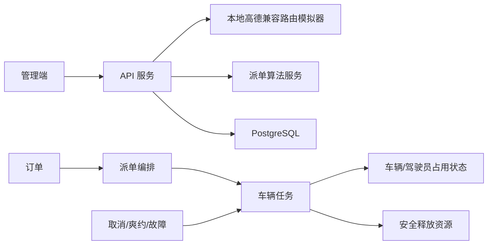

# P3-6 自动派单与运行闭环修复设计

## 1. 背景与目标

P3 试点准备验收已完成手工派单、运行事件、异常处置等主要流程，但 P3-6 暴露出以下阻断项：

1. 本地环境未启用地图路由，订单只能进入 `MAP_ROUTE_UNAVAILABLE` 人工复核，无法验收自动派单。
2. 爽约订单关闭后，对应车辆任务仍保持 `DISPATCHED`。
3. 已派发任务未同步占用车辆和驾驶员，同一车辆仍可能被当作空闲资源重复派发。
4. 任务完成弹窗默认携带 `virtualStopId`，与后端任务级完成接口的参数约束冲突。
5. 经人工复核后确认的订单仍保留历史 `MAP_ROUTE_UNAVAILABLE` 原因。
6. 后端已支持首次改密，但前端没有强制改密页面和路由守卫。
7. `dispatcher02` 按最小权限设计不能访问审计页和运营看板。

本次修复目标是：

- 在不访问外部地图服务的前提下，提供仅用于本地试点验收的确定性模拟路由。
- 保证订单、任务、车辆和驾驶员的运行状态一致。
- 修正前端任务完成与首次改密流程。
- 使用 `dispatcher02` 验收日常调度能力，使用 `SYSTEM_ADMIN` 验收审计页和运营看板，不扩大调度员权限。
- 重新执行 P3-6，并形成可追溯的验收证据。

## 2. 约束与非目标

### 2.1 约束

- 保持 `dispatcher02` 的 `DISPATCHER` 角色和现有权限不变。
- 模拟路由只在本地试点 Compose 环境显式启用，生产默认配置继续使用真实地图提供方或禁用状态。
- 不调用外部地图接口，不依赖互联网。
- 保留现有验收数据和证据；历史遗留任务通过业务接口审计关闭，不直接无痕改库。
- 所有修复采用测试先行方式实施。

### 2.2 非目标

- 不实现真实道路拓扑、交通拥堵或地图纠偏。
- 不调整派单评分参数或 `REALTIME_INSERTION` 策略。
- 不重新设计角色权限模型。
- 不替 `dispatcher02` 设置或保存未知的正式密码；强制改密能力使用模拟账号或自动化测试验证。

## 3. 总体方案

采用独立本地路由模拟服务，并在领域服务中补齐资源生命周期和异常联动。

## 4. 本地路由模拟器

### 4.1 部署边界

在试点 Compose 中增加独立服务 `route-simulator`。API 仅在该 Compose 环境设置：

- `DRT_AMAP_ENABLED=true`
- `DRT_AMAP_WEB_SERVICE_KEY=local-simulator`
- `DRT_AMAP_BASE_URL=http://route-simulator:<port>`

默认应用配置不启用模拟器，模拟器也不作为生产运行依赖。

### 4.2 兼容接口

模拟器实现 API 当前使用的两个高德兼容接口：

- `GET /v3/direction/driving`
- `GET /v3/distance`

请求参数沿用现有 `origin`、`destination`、`waypoints`、`origins` 和 `type`。

### 4.3 确定性计算

- 使用坐标计算直线距离，并乘以固定道路绕行系数。
- 使用固定平均行驶速度计算时长，并设置合理的最小距离和最小时长。
- 驾车路线按起点、途经点和终点生成 polyline。
- 相同请求始终返回相同结果，保证测试可重复。
- 参数缺失或坐标非法时返回与高德失败结构相容的错误结果。

模拟器只解决“地图路由可用性”验收，不宣称结果具备真实道路精度。

## 5. 任务与资源状态一致性

### 5.1 状态占用

创建并派发新任务时：

- 车辆从 `IDLE` 进入已派发/占用状态。
- 驾驶员从可用状态进入忙碌状态。

任务开始执行时：

- 车辆进入运行中状态。
- 驾驶员保持忙碌。

任务完成、取消或异常关闭时：

- 仅当车辆或驾驶员没有其他未终结任务时，才恢复为空闲/可用。
- 释放逻辑在同一事务内执行，防止任务已终结而资源仍被占用。

### 5.2 候选防御

自动派单组装候选时，除了检查车辆状态，还检查车辆是否存在未终结任务：

- 有未终结任务的车辆不得作为“新任务车辆”再次入选。
- 允许符合插单条件的现有任务继续进入 `REALTIME_INSERTION` 候选。
- 该检查兼容历史脏数据，即使车辆状态仍误标为 `IDLE`，也不会被重复派发。

### 5.3 爽约联动

订单确认爽约时：

- 如果对应任务只服务这一笔订单，则终结任务并安全释放资源。
- 如果是共享任务，则把该订单对应的未完成停靠点标记为已取消，不影响同车其他订单。
- 被取消停靠点视为不再阻塞任务完成。
- 订单、任务/停靠点和审计记录在同一事务中写入。

修复前遗留的爽约任务使用现有任务异常接口，以“P3-6 修复前爽约遗留任务清理”为原因关闭，保留审计轨迹。

## 6. 订单状态清理

订单从人工复核恢复确认时，清除仅代表路由失败历史的 `failureReason`，避免已正常确认或完成的订单继续显示 `MAP_ROUTE_UNAVAILABLE`。

如果确认流程再次发生新的业务失败，则由对应失败路径重新写入原因。

## 7. 管理端修复

### 7.1 任务完成

任务级“完成”操作使用车辆最新位置或末站坐标作为位置快照，但不发送 `virtualStopId` 和 `taskStopId`。站点级到达、上车、下车操作继续携带站点标识。

### 7.2 强制改密

新增改密页面和认证 API 调用：

- 登录或恢复会话后，如果 `mustChangePassword=true`，只能进入改密页或退出登录。
- 改密成功后，旧会话失效，用户返回登录页并使用新密码重新登录。
- 普通业务路由不能绕过强制改密守卫。
- 使用测试账号验证此控制，不擅自替换 `dispatcher02` 的正式密码。

### 7.3 最小权限验收

- `dispatcher02`：验收订单、调度、车辆任务和位置上报等日常调度页面。
- `SYSTEM_ADMIN`：验收运营看板、审计日志和必要的用户管理页面。
- 不修改角色权限映射，不给 `DISPATCHER` 增加 `AUDIT_READ` 或 `METRICS_READ`。

## 8. 错误处理与审计

- 模拟路由器不可达或响应非法时，API 保持现有 `MAP_ROUTE_UNAVAILABLE` 降级行为。
- 资源占用冲突时拒绝重复派发，不部分提交任务。
- 资源释放只在没有其他活动任务时执行，避免释放仍在运行的资源。
- 爽约联动、任务异常关闭、首次改密等关键动作继续产生现有审计记录。
- 不在日志、证据或提交中记录明文密码、令牌和外部账号凭据。

## 9. 测试策略

按照红—绿—重构顺序实施：

1. 路由模拟器契约测试：驾车、距离、途经点、非法参数、确定性。
2. 后端领域/服务测试：
   - 确认订单清除历史失败原因。
   - 新任务占用车辆和驾驶员。
   - 候选排除已有活动任务的空闲脏状态车辆。
   - 完成、取消、异常后安全释放资源。
   - 单订单任务爽约终结任务。
   - 共享任务爽约仅取消对应停靠点。
3. 前端单元测试：
   - 任务完成请求不携带站点标识。
   - 强制改密守卫不能绕过。
   - 改密成功后清除会话并返回登录页。
4. 全量回归：
   - API Maven 测试。
   - 管理端单元测试和构建。
   - Compose 服务健康检查。
5. 浏览器验收：
   - 模拟订单自动派单成功，自动决策数不再为 0。
   - 车辆不会重复承接多个新任务。
   - 爽约后任务与资源闭环。
   - 任务完成不再报 `virtualStopId` 冲突。
   - 模拟首次登录账号被强制引导改密。
   - `SYSTEM_ADMIN` 可访问审计页和运营看板。
   - `dispatcher02` 仍无法访问超出权限的页面。

## 10. P3-6 完成标准

满足以下条件后收口 P3：

- 自动派单在本地模拟路由环境完成一次端到端验收。
- 手工与自动派单、任务执行、完成和异常闭环均通过。
- 车辆、驾驶员、任务和订单状态一致，无重复派发。
- 历史路由失败原因不残留在已恢复订单上。
- 强制改密控制验证通过。
- 最小权限边界保持不变，审计页和运营看板由 `SYSTEM_ADMIN` 验收通过。
- 全量自动化测试通过，容器健康。
- 验收结果写入 P3 证据文档和 `progress.md`。
